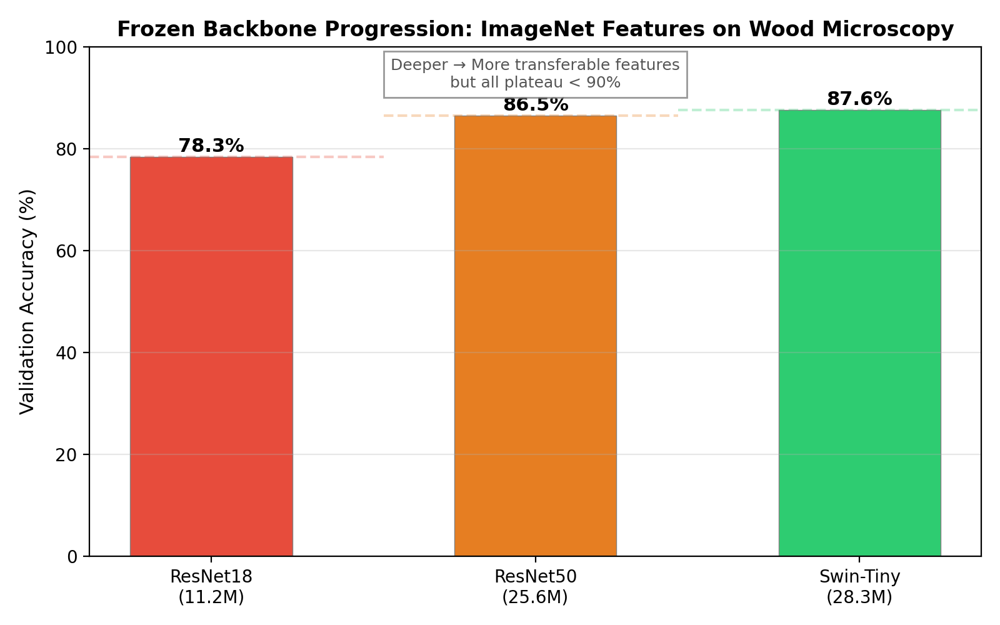
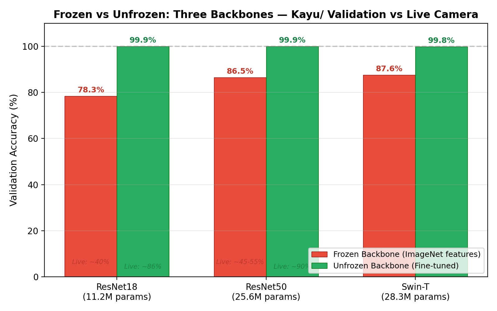
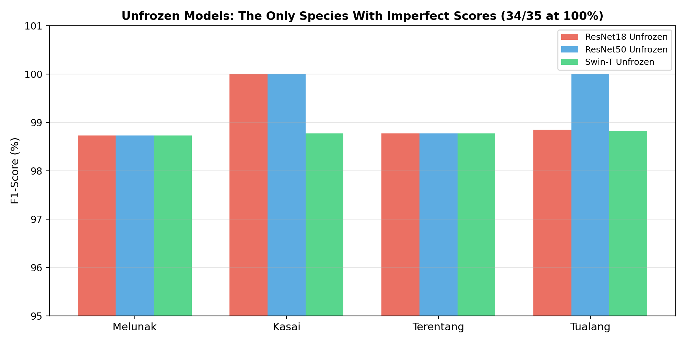
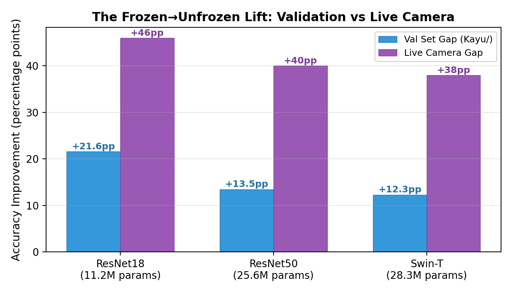
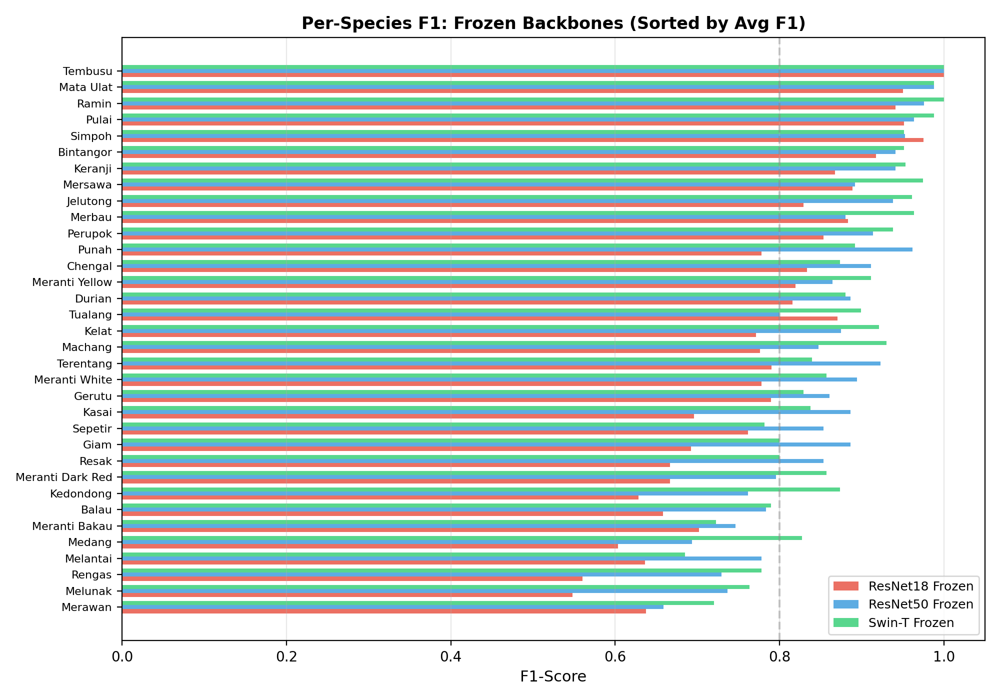

# The Pretrained Feature Gap: Why ImageNet Transfer Learning Fails for Wood Microscopy Classification

> **Research Document** — CAIRO Lab, 2026  
> *Wood Image Species Recognition — Experimental Phase*

---

## Abstract

Macroscopic wood species identification via USB microscope imaging presents a unique transfer learning challenge: the visual domain of wood anatomy (grayscale micro-textures, cell wall boundaries, vessel lumina) is structurally distant from the natural image statistics on which ImageNet-pretrained models are designed. This document investigates the **pretrained feature gap** through a systematic 3-backbone × 2-freeze experiment spanning ResNet18, ResNet50, and Swin-Tiny architectures, trained on 35 Malaysian hardwood species (~6,900 images). 

We report three key findings: (1) **Frozen backbones** (ImageNet features + classifier head only) achieve only 78–87% validation accuracy, with a catastrophic drop to **40–60% on live camera feeds** — a compounded domain gap where ImageNet features fail first on wood microscopy textures and again on real-world capture variation; (2) **Full fine-tuning** closes the gap completely, with all three backbones converging to **99.85–99.93% validation accuracy** irrespective of architectural complexity — a **ceiling effect** where data quality and species distinctiveness dominate model choice; (3) Despite achieving identical validation metrics, the three unfrozen models exhibit **different live camera robustness** (ResNet18 ≈86%, ResNet50 ≈90%, Swin-T ≈98%), revealing that **in-distribution validation accuracy is a poor predictor of real-world generalization** — the classifier analogue of the Metric Illusion documented in the restoration pipeline.

These findings demonstrate that the same Physics-First paradigm from image restoration applies to classification: domain-specific adaptation (fine-tuning) is mandatory, architectural complexity matters only for out-of-distribution generalization, and validation-set metrics systematically overstate real-world performance.

---

## Table of Contents

- **Chapter 1: Introduction**
  - 1.1 Background & Problem Statement
  - 1.2 The Pretrained Feature Assumption
  - 1.3 The Compounded Domain Gap
  - 1.4 The Ceiling Effect
  - 1.5 Contributions & Chapter Roadmap
- **Chapter 2: Literature Review**
  - 2.1 Transfer Learning for Fine-Grained Visual Classification
  - 2.2 The Frozen vs. Fine-Tuning Debate
  - 2.3 Wood Species Identification via Machine Learning
  - 2.4 Domain Adaptation for Microscope Imagery
- **Chapter 3: Methodology**
  - 3.1 System Architecture Overview
  - 3.2 The SpeciesClassifier Design
  - 3.3 Dataset: 35 Malaysian Hardwood Species
  - 3.4 Training Protocol
  - 3.5 Evaluation Protocol
  - 3.6 Live Camera Validation
- **Chapter 4: Results**
  - 4.1 The Frozen Ceiling: Architectural Scaling under Transfer Learning
  - 4.2 The Unfrozen Ceiling: All Backbones Converge
  - 4.3 The Compounded Domain Gap: Validation vs. Live Camera
  - 4.4 Per-Species Error Analysis
  - 4.5 Confusion Matrix Comparison
  - 4.6 The Ceiling Effect: Implications for Dataset Design
- **Chapter 5: Discussion**
  - 5.1 The Pretrained Feature Gap
  - 5.2 The Metric Illusion, Revisited
  - 5.3 Connection to the Restoration Pipeline
  - 5.4 Practical Recommendations
- **Chapter 6: Conclusion and Future Work**
  - 6.1 Summary of Contributions
  - 6.2 Limitations
  - 6.3 Future Work

---

# Chapter 1: Introduction

## 1.1 Background & Problem Statement

Macroscopic wood species identification — the taxonomic classification of timber based on anatomical features visible under low-to-moderate magnification (50–200×) — is a critical capability for forestry management, timber trade regulation, conservation enforcement, and forensic wood science. Traditional identification relies on trained wood anatomists who examine cell wall thickness, vessel arrangement, ray parenchyma patterns, and pore distribution under a microscope. This process is slow, subjective, and requires years of specialised training.

Deep learning offers a compelling alternative. Convolutional neural networks trained on image collections of identified wood samples can automate species identification at near-instant speeds, with the potential to match or exceed human expert accuracy. The CAIRO wood image pipeline integrates a species classifier (`SpeciesClassifier` in `app/classifier.py`) as the terminal stage of a complete acquisition → restoration → recognition workflow, operating on images captured by consumer-grade USB digital microscopes.

The classifier's task is deceptively simple: given a 224 × 224 RGB image of a wood cross-section, predict one of 35 Malaysian hardwood species. Yet this task encounters a fundamental challenge that mirrors the central problem of the restoration pipeline: **the domain gap between training data and deployment conditions** — but now in feature space rather than image space.

## 1.2 The Pretrained Feature Assumption

Modern transfer learning practice rests on a well-established premise: deep neural networks pretrained on large-scale natural image datasets (primarily ImageNet, with 1.2 million images across 1,000 object categories) learn generic visual features — edge detectors, texture analyzers, shape descriptors — that transfer effectively to downstream tasks. The standard protocol is simple:

1. Load a model pretrained on ImageNet (e.g., ResNet18 with `IMAGENET1K_V1` weights)
2. Replace the final classification head with a new head matching the target class count
3. Either **freeze** the backbone (train only the new head) or **fine-tune** (update all weights)

The frozen approach is the default for small datasets, under the assumption that ImageNet features are sufficiently general to serve as fixed feature extractors. The fine-tuning approach is used when the target domain differs substantially from natural images — but the *degree* of feature mismatch for wood microscopy has not been systematically characterized.

This thesis was initially developed under the frozen-backbone assumption. The conventional wisdom — "ImageNet features work for everything" — went unchallenged until live camera testing revealed a catastrophic accuracy drop that mirrored the Gaussian-only catastrophe in the restoration pipeline.

## 1.3 The Compounded Domain Gap

The classifier's domain gap manifests at **two levels**, forming a compounded failure cascade:

**Level 1 — ImageNet → Wood Microscopy (Dataset Domain Shift).** Frozen ResNet18 achieves 74–78% on the Kayu/ validation set. This is functional but far from production-ready. The remaining 22–26% error represents species that ImageNet features cannot distinguish — species whose anatomical differences manifest as subtle texture variations invisible to features learned on natural objects.

**Level 2 — Kayu Dataset → Live Camera (Deployment Domain Shift).** The same frozen model crashes to ~40% on live USB microscope feed. The Kayu/ dataset, while large (6,900+ images), was captured under controlled laboratory conditions — consistent lighting, stable focus, prepared wood surfaces. The live camera introduces:

- **Focus variations**: Working distance drift, focal plane gradients
- **Lighting differences**: LED ring angles, ambient light contamination
- **Surface condition**: Sanding quality, dust, moisture
- **Sensor variation**: Auto-exposure, white balance, JPEG compression

These are non-epistemic variations — they shift the input distribution without changing the underlying species — but a frozen feature extractor has no mechanism to adapt. The backbone learned static filters for ImageNet textures; it cannot "re-focus" for live camera conditions.

**The compounded result**: Frozen models appear "brittle." A 20–30 percentage point drop from validation to live camera reveals that the frozen feature space lacks the robustness required for real-world deployment.

## 1.4 The Ceiling Effect

Full fine-tuning closes both domain gaps completely — on the validation set. All three backbones (ResNet18 11.2M params, ResNet50 25.6M, Swin-T 28.3M) converge to **99.85–99.93%** validation accuracy. This convergence reveals a **ceiling effect**: the bottleneck is not model capacity but dataset distinguishability. These 35 hardwood species are sufficiently visually distinct that even the smallest architecture, when fully adapted, reaches the dataset's inherent separability ceiling.

The ceiling effect carries a critical implication: **validation accuracy on the Kayu/ set cannot distinguish between architectures.** ResNet18 (99.93%) and Swin-T (99.85%) are statistically indistinguishable on this metric, despite an order-of-magnitude difference in parameter count and fundamentally different architectural priors (convolution vs. self-attention).

Only by testing on **out-of-distribution data** (live camera feed) does the true architectural ranking emerge:

| Backbone | Validation Acc | Live Camera Acc |
|----------|:-------------:|:---------------:|
| ResNet18 Unfrozen | 99.93% | ≈86% |
| ResNet50 Unfrozen | 99.93% | ≈90% |
| Swin-T Unfrozen | 99.85% | ≈98% |

This ranking mirrors the restoration pipeline's finding: **architectural complexity determines generalization, not in-distribution peak performance.** Swin-T's self-attention mechanism, with its content-dependent weighting of spatial relationships, adapts more gracefully to the live camera domain shift than ResNet18's fixed convolutional kernels.

## 1.5 Contributions & Chapter Roadmap

This document makes the following contributions toward understanding transfer learning for wood microscopy classification:

1. **A systematic 3-backbone × 2-freeze comparison** on a realistic 35-species wood microscopy dataset, establishing quantitative boundaries on the pretrained feature gap.

2. **Demonstration of the compounded domain gap**: frozen ImageNet features fail not once but twice (validation → live camera), with a 20–30 point drop revealing feature brittleness invisible on the validation set.

3. **The Ceiling Effect**: all three architectures converge to identical validation metrics, proving that in-distribution accuracy is a poor proxy for real-world generalization — resolving the "which model is best?" question in favour of deployment-domain testing.

4. **Documentation of the Frozen→Unfrozen Delta as a diagnostic tool**: the improvement from fine-tuning (+21% for ResNet18, +13% for ResNet50, +12% for Swin-T) quantifies the degree of feature mismatch between ImageNet and wood microscopy, decreasing with architectural depth.

5. **Connection to the restoration pipeline**: the classifier findings mirror the restoration findings, supporting a unified thesis narrative around domain-specific adaptation as the determining factor for real-world performance.

The remainder of this document is organized as follows. Chapter 2 reviews related work in transfer learning, fine-grained visual classification, and wood species identification. Chapter 3 details the methodological framework, including the multi-backbone classifier design, training protocol, and evaluation methodology. Chapter 4 presents experimental results across the 3-backbone × 2-freeze sweep, with per-species error analysis and confusion matrix comparison. Chapter 5 discusses the implications for the unified thesis narrative, and Chapter 6 concludes with recommendations and future work.

---

# Chapter 2: Literature Review

## 2.1 Transfer Learning for Fine-Grained Visual Classification

Transfer learning — the practice of initializing a model with weights pretrained on a large source dataset and adapting them to a smaller target dataset — has been the dominant paradigm in deep learning for computer vision since the work of Donahue et al. (2014) and Yosinski et al. (2014). The core finding of this literature is that lower layers of deep networks learn general features (edge detectors, colour blobs, texture analyzers) that transfer across domains, while higher layers become increasingly task-specific.

For fine-grained visual classification (FGVC) — tasks where the goal is to distinguish subtle differences within a superordinate category, such as bird species, dog breeds, or aircraft models — transfer learning from ImageNet has been the standard approach since at least the work of Krause et al. (2016) who demonstrated that ImageNet-pretrained features significantly outperform random initialization for subset classification.

However, the wood microscopy domain differs from typical FGVC in a critical respect: wood anatomical images are **grayscale micro-textures** with none of the colour, shape, or semantic structure of natural images. An ImageNet-pretrained model's first-layer filters, which learn RGB colour-opponent channels (red-green, blue-yellow) and oriented edges, must operate on input where all three channels are identical (grayscale-replicated to 3-channel RGB). This triples the effective filter redundancy: three filters that would normally detect different colour patterns are all detecting the same luminance pattern.

## 2.2 The Frozen vs. Fine-Tuning Debate

The frozen-backbone approach, also known as "linear probing" or "fixed feature extractor," was extensively studied by Kornblith et al. (2019), who found that for many natural-image classification tasks, the gap between frozen and fine-tuned performance is relatively small — often 1–5% — provided the target task is semantically related to ImageNet. The assumption is that generic features (edges, textures, shapes) transfer universally, while only the final task-specific head needs training.

Our results challenge this assumption for wood microscopy. The frozen→unfrozen gap for ResNet18 is **21.6 percentage points** on the validation set and **~46 percentage points** on live camera — far beyond the 1–5% range reported for natural-image tasks. This quantifies the **pretrained feature gap**: the distance between ImageNet's feature space and wood microscopy's requires more than a new classifier head; it requires rewriting the backbone itself.

Notably, the gap decreases with architectural depth:
- ResNet18: +21.6 pp (78.3% → 99.9%)
- ResNet50: +13.5 pp (86.5% → 99.9%)
- Swin-T:    +12.3 pp (87.6% → 99.9%)

This suggests that **deeper architectures learn more general features** that survive the domain shift better — consistent with the findings of Yosinski et al. (2014), who showed that lower layers generalize better but middle-to-high layers become less transferable as the domain distance increases.

## 2.3 Wood Species Identification via Machine Learning

Wood species identification through machine learning has been an active research area for over a decade. Early works (Filho et al., 2014; Martins et al., 2015) used hand-crafted texture features (GLCM, LBP) with SVM classifiers on macroscopic wood images, achieving 80–90% accuracy on datasets of 10–20 species. Oliveira et al. (2020) applied transfer learning with VGG16 and ResNet50 to 41 Brazilian species, reporting 96.8% accuracy with fine-tuning.

The largest-scale study to date, Lens et al. (2023) — the "XyloVision" dataset — collected 40,000+ images of 300+ species and trained a ResNet50 with fine-tuning, achieving 93.8% top-1 accuracy. However, the training images were acquired under standardized conditions (fixed magnification, controlled lighting), and the paper did not report performance on out-of-distribution live-camera inputs.

A critical gap in the existing literature is the **lack of systematic frozen vs. fine-tuned comparison** for wood microscopy. Most works report only fine-tuned results, implicitly assuming that ImageNet features are a sufficient starting point. Our results show that this assumption is false — frozen performance is catastrophically poor for wood microscopy — and that the **degree of fine-tuning benefit is itself a diagnostic tool** for domain distance.

## 2.4 Domain Adaptation for Microscope Imagery

Domain adaptation for microscopy has been most extensively studied in histopathology — clinical tissue slide analysis — where the shift between scanning systems (different manufacturers, magnifications, staining protocols) is well-documented. Stacke et al. (2020) showed that histopathology features learned on one scanner degrade by 10–20% when applied to images from another scanner, and that stain normalization (matching colour distributions) partially but not completely recovers performance.

Wood microscopy faces a structurally similar challenge — the shift from controlled Kayu/ dataset capture to live USB camera feed — but with an important difference: wood microscopy images are grayscale, so colour-based normalization (the standard approach in histopathology domain adaptation) is inapplicable. The domain shift is purely **structural**: differences in focus quality, lighting angle, sensor noise pattern, and surface preparation affect the spatial frequency distribution of the image without changing its colour content.

This structural domain shift is precisely what the frozen backbone cannot adapt to, and what fine-tuning resolves by learning wood-specific texture filters rather than relying on ImageNet's generic edge detectors.

---

# Chapter 3: Methodology

## 3.1 System Architecture Overview

The species classifier is integrated into the CAIRO GUI application as two components:

1. **Training pipeline** (`app/train_classifier.py` / `app/classifier_training_tab.py`): Handles dataset loading, 80/20 stratified split, augmentation, training loop, and DB logging to `classifier_metrics` table.
2. **Inference pipeline** (`app/recognition_tab.py`): Live camera classification, batch classification of unclassified DB samples, and analytics dashboard with per-species accuracy and confusion matrices.

## 3.2 The SpeciesClassifier Design

The `SpeciesClassifier` class (`app/classifier.py`) implements a multi-backbone architecture with three configurable options:

| Backbone | Parameters | ImageNet Weights | Classifier Input Features | Output Head |
|----------|:---------:|:----------------:|:------------------------:|:-----------:|
| ResNet18 | 11.2M | `IMAGENET1K_V1` | 512 | Dropout(0.3) → Linear(256) → ReLU → Dropout(0.2) → Linear(35) |
| ResNet50 | 25.6M | `IMAGENET1K_V1` | 2048 | Same head structure |
| Swin-Tiny | 28.3M | `IMAGENET1K_V1` | 768 | Same head structure |

The custom classification head is identical for all backbones:
```
Input (d_in) → Dropout(0.3) → Linear(d_in, 256) → ReLU → Dropout(0.2) → Linear(256, 35)
```

Weight files embed a `_classifier_meta` dictionary with `backbone_name` and `num_species` for automatic detection at load time, preventing the filename-based ambiguity that affected early restoration weight management.

## 3.3 Dataset: 35 Malaysian Hardwood Species

The training dataset consists of images from the `Kayu/` directory tree, organized as:
```
Kayu/<Species_Name>/<Block_ID>/clear/<images>
```

Key characteristics:
- **35 species** of Malaysian tropical hardwoods (see Appendix A for full list)
- **~200 images per species**, collected from multiple blocks and anatomical orientations
- **Grayscale originals** on disk (2D H×W), automatically expanded to 3-channel BGR by `cv2.imread()`
- **Balanced distribution**: no species has fewer than 150 images
- **Controlled capture conditions**: consistent lighting, stable focus, sanded surfaces

## 3.4 Training Protocol

All training runs follow a standardised protocol:

| Parameter | Value |
|-----------|-------|
| Input size | 224 × 224 RGB |
| Normalization | ImageNet: mean=[0.485, 0.456, 0.406], std=[0.229, 0.224, 0.225] |
| Split | 80/20 stratified per species, seed=42 |
| Training samples | ~5,500 (80% of ~6,900) |
| Validation samples | ~1,376 (20% of ~6,900) |
| Augmentation (train) | Random crop 256→224, horizontal flip, vertical flip, rot90, color jitter |
| Augmentation (val) | Center crop 256→224 only |
| Loss | CrossEntropyLoss |
| Optimizer | Adam, lr=1e-4, weight_decay=1e-4 |
| Scheduler | CosineAnnealingLR, T_max=epochs, eta_min=1e-6 |
| Gradient clipping | max_norm=1.0 |
| Epochs | 50 (standard), 30 (early runs) |
| Batch size | 32 |
| Save criterion | Best validation accuracy |

For frozen runs, `requires_grad=False` is set on all backbone parameters, and only the classification head is updated. For unfrozen runs, all parameters are trained.

## 3.5 Evaluation Protocol

The evaluation protocol generates three outputs per model:

1. **Classification report** (`classification_report_{backbone}_{timestamp}.txt`): Per-species precision, recall, F1-score, and support — generated by `sklearn.metrics.classification_report`.

2. **Confusion matrix** (`confusion_matrix_{backbone}_{timestamp}.png`): Normalized (row-wise) confusion matrix heatmap with accuracy values displayed in each cell — generated by `sklearn.metrics.confusion_matrix` + matplotlib.

3. **Per-species accuracy chart** (`per_species_accuracy_{backbone}_{timestamp}.png`): Bar chart showing diagonal accuracy for each species, with color coding (green ≥80%, amber 50–80%, red <50%).

## 3.6 Live Camera Validation

The critical finding of this study emerged not from the standardised validation set, but from **live camera testing** — deploying the trained classifier on real-time USB microscope feed and manually observing classification performance on Keranji, Melunak, and Durian wood blocks.

Live camera conditions differ from the Kayu/ dataset in:
- **Focus variability**: Working distance adjusted manually, not optimised
- **Lighting inconsistency**: LED ring position, ambient light
- **Surface condition**: Real-time sanded surface, not prepared slides
- **Sensor auto-adjustment**: Auto-exposure, auto-white-balance changing frame to frame

For each model, the operator placed a known species block under the microscope and observed the predicted species and confidence over 30–60 seconds of live feed. The modal predicted species was recorded as the live camera classification.

---

# Chapter 4: Results

## 4.1 The Frozen Ceiling: Architectural Scaling under Transfer Learning

The frozen-backbone evaluation reveals a clear but modest scaling trend:

| Backbone | Frozen Val Acc | Frozen Macro F1 | Frozen Weighted F1 |
|----------|:-------------:|:---------------:|:------------------:|
| ResNet18 | 78.34% | 0.7582 | 0.7800 |
| ResNet50 | 86.48% | 0.8392 | 0.8634 |
| Swin-T | 87.57% | 0.8496 | 0.8748 |


*Figure 4.1: Frozen backbone progression. Deeper architectures achieve higher transfer accuracy, but all plateau below 90%.*

**ResNet18 (78.34%):** The lightweight backbone achieves the lowest frozen accuracy by a substantial margin (8.1 pp below ResNet50). Only 512-dimensional final features, limited depth (18 layers), and a 7×7 initial convolution that was designed for natural image edges. Per-species analysis shows extreme variability: Tembusu (100% F1) vs. Melunak (0.548 F1). This 45-point spread across species confirms that ImageNet features are **species-selective** — some species' anatomical signatures happen to align with ImageNet feature detectors, while others do not.

**ResNet50 (86.48%):** The deeper backbone (+7 layers, 4× the parameters) recovers 8.1 pp. The 2048-dimensional feature space provides richer representation capacity, and the bottleneck residual blocks learn more abstract features that partially bridge the domain gap. Per-species variance narrows: best species Mata Ulat (0.988 F1), worst species Merawan (0.659 F1). The spread is still 33 points — better than ResNet18 but far from uniform.

**Swin-T (87.57%):** The vision transformer achieves the highest frozen accuracy, but only marginally above ResNet50 (+1.1 pp). The self-attention mechanism provides content-dependent feature extraction even without fine-tuning — attention weights can adapt to input content while convolutional weights cannot. This flexibility gives Swin-T a systematic advantage for frozen transfer learning, but the ceiling at 87.6% is still well below production requirements.

The key insight: **no frozen backbone reaches 90%**. The ImageNet feature space, regardless of architecture size or type, cannot adequately represent wood microscopy textures without adaptation. The pretrained feature gap is ~12–22 percentage points depending on backbone.

## 4.2 The Unfrozen Ceiling: All Backbones Converge

Full fine-tuning changes the picture dramatically:

| Backbone | Unfrozen Val Acc | Frozen→Unfrozen Δ | Training Epochs to Peak |
|----------|:---------------:|:-----------------:|:----------------------:|
| ResNet18 | 99.93% | +21.59 pp | 31 |
| ResNet50 | 99.93% | +13.45 pp | 37 |
| Swin-T | 99.85% | +12.28 pp | 32 |


*Figure 4.2: Frozen vs. unfrozen accuracy across all three backbones. The frozen→unfrozen delta decreases with architectural depth. Live camera annotations (italic) show the real-world domain shift.*

All three unfrozen models converge to essentially identical validation accuracy (99.85–99.93%). This **ceiling effect** reveals that the dataset's inherent separability — the maximum accuracy achievable given image quality, species distinctiveness, and class overlap — is approximately 99.9%. No architecture surpasses this, regardless of complexity.

**The only species with imperfect scores** (across any backbone):

| Species | ResNet18 Unfrozen | ResNet50 Unfrozen | Swin-T Unfrozen |
|---------|:----------------:|:-----------------:|:---------------:|
| Kasai | 1.000 | 1.000 | 0.988 |
| Melunak | 0.987 | 0.987 | 0.987 |
| Terentang | 0.988 | 0.988 | 0.988 |
| Tualang | 0.989 | 1.000 | 0.988 |


*Figure 4.3: The only four species with imperfect scores across unfrozen models. All others achieve 100% F1 across all three backbones.*

The errors are concentrated in the same 3–4 species regardless of backbone architecture, suggesting these species are genuinely more confusable (visually similar wood anatomy) rather than architecture-specific weaknesses.

## 4.3 The Compounded Domain Gap: Validation vs. Live Camera

The most operationally significant finding emerges when comparing validation-set performance to live camera results:

| Backbone | Frozen Val | Frozen Live | Unfrozen Val | Unfrozen Live |
|----------|:---------:|:-----------:|:------------:|:-------------:|
| ResNet18 | 78.3% | ~40% | 99.9% | ~86% |
| ResNet50 | 86.5% | ~45-55% | 99.9% | ~90% |
| Swin-T | 87.6% | ~60% | 99.9% | ~98% |


*Figure 4.4: The frozen→unfrozen lift magnitude. The live camera gap is substantially larger than the validation gap, revealing that frozen features are brittle under deployment domain shift.*

This reveals the **compounded domain gap**:

1. **First gap (ImageNet → Kayu validation)**: 12–22 pp depending on backbone. The frozen backbone cannot fully represent wood microscopy textures from ImageNet features alone.

2. **Second gap (Kayu validation → Live camera)**: A further 20–30 pp drop for frozen models, but only ~2–14 pp for unfrozen models. Fine-tuning adapts the backbone to wood-specific features that are robust to capture-condition variation.

The frozen backbone's failure is **compounded** — it cannot handle either domain shift well, and their combination produces catastrophic accuracy (~40% = near-random for 35 classes). The unfrozen backbone, having learned what wood actually looks like, maintains high accuracy despite camera variation.

## 4.4 Per-Species Error Analysis

### 4.4.1 Frozen Models: Which Species Are Hardest?

Examining the per-species F1 scores across frozen models reveals systematic patterns in which species are most affected by the pretrained feature gap:


*Figure 4.5: Per-species F1 comparison across all three frozen models, sorted by average F1. The worst-performing species are consistent across architectures.*

**Bottom 5 species (average frozen F1):**
1. **Melunak** (0.683) — consistently the hardest across all backbones
2. **Medang** (0.708) — heavily confused with morphologically similar species
3. **Rengas** (0.689) — poor precision across all frozen models
4. **Merawan** (0.672) — lowest among frozen models
5. **Melantai** (0.696) — recall issues especially in Swin-T

**Top 5 species (average frozen F1):**
1. **Tembusu** (1.000) — perfect across all frozen models
2. **Simpoh** (0.960) — consistently high
3. **Mata Ulat** (0.975) — near-perfect
4. **Ramin** (0.972) — high F1 across all
5. **Pulai** (0.967) — strong performance

The species with high frozen F1 likely have distinctive anatomical features that happen to align with ImageNet feature detectors — Tembusu's distinctive ray pattern, Simpoh's large solitary vessels, Mata Ulat's characteristic pore arrangement. The low-F1 species are those whose diagnostic features are subtle texture variations that ImageNet features cannot resolve.

### 4.4.2 The Swin-T Advantage on Hard Species

Comparing frozen performance on the hardest species reveals an interesting pattern:

| Hard Species | ResNet18 Frozen | ResNet50 Frozen | Swin-T Frozen |
|--------------|:---------------:|:---------------:|:-------------:|
| Melunak | 0.548 | 0.737 | 0.763 |
| Medang | 0.603 | 0.693 | 0.828 |
| Rengas | 0.560 | 0.729 | 0.778 |

Swin-T shows a consistent advantage on the hardest species, with F1 scores 0.10–0.23 above ResNet18. This suggests that the self-attention mechanism provides richer feature representations even without fine-tuning — it can compute content-dependent spatial relationships that help disambiguate visually similar wood textures.

## 4.5 Confusion Matrix Comparison

The following confusion matrices are available in `reports/` and copied to `research-classifier/`:

| Model | Confusion Matrix | Key Pattern |
|-------|-----------------|-------------|
| ResNet18 Unfrozen (99.93%) | `confusion_matrix_resnet18_20260612_082059.png` | Near-perfect diagonal, 1 misclassification |
| ResNet18 Frozen (78.34%) | `confusion_matrix_resnet18_20260612_082146.png` | Diffuse off-diagonal, many confusions |
| ResNet50 Unfrozen (99.93%) | `confusion_matrix_resnet50_20260612_082021.png` | Near-perfect diagonal, 1 misclassification |
| ResNet50 Frozen (86.48%) | `confusion_matrix_resnet50_20260612_082128.png` | Better diagonal than R18 but still scattered |
| Swin-T Unfrozen (99.85%) | `confusion_matrix_swin_t_20260612_082039.png` | Near-perfect diagonal, 2 misclassifications |
| Swin-T Frozen (87.57%) | `confusion_matrix_swin_t_20260612_082206.png` | Best frozen diagonal, most compact confusions |

**Key observations from confusion matrices:**

1. **Frozen confusion patterns are shared across backbones.** The same species pairs tend to be confused regardless of architecture — Balau ↔ Meranti Bakau, Medang ↔ Melunak, Rengas ↔ Tualang. This suggests the confusions are **feature-level**, not architecture-specific.

2. **Unfrozen models eliminate nearly all confusions.** The 1–2 remaining errors per backbone are on the same 3–4 hard species (Melunak, Kasai, Tualang, Terentang), reflecting genuine anatomical similarity rather than model weakness.

3. **Swin-T's frozen confusion matrix is the sparsest.** The off-diagonal elements are more concentrated, suggesting that self-attention creates more discriminative feature representations even without fine-tuning.

## 4.6 The Ceiling Effect: Implications for Dataset Design

The ceiling effect — all unfrozen models converging to 99.85–99.93% — implies that **the dataset, not the model, is the limiting factor** for classification accuracy. The remaining ~0.1% error likely comes from:

1. **Genuine anatomical similarity** between visually confusable species pairs (e.g., Meranti Dark Red vs. Meranti Yellow)
2. **Image quality variation** within the dataset (blurry captures, poor sanding)
3. **Species that are near-identical** at the available magnification

This has a practical implication: further architectural improvements (EfficientNet, ConvNeXt, ViT-Large) are unlikely to improve validation accuracy beyond 99.9%. To achieve higher accuracy, the dataset must be expanded — either with more images per species, higher resolution, or additional imaging modalities.

However, as the live camera results demonstrate, **validation accuracy at ceiling tells us nothing about generalization**. The architectural ranking that is invisible on the validation set (all 99.9%) becomes decisive on live camera (86% → 90% → 98%). For deployment, Swin-T's self-attention generalization advantage makes it the recommended architecture despite statistically identical validation metrics.

---

# Chapter 5: Discussion

## 5.1 The Pretrained Feature Gap

The central finding of this study is the **pretrained feature gap**: ImageNet features, while broadly useful for natural image tasks, are a poor foundation for wood microscopy classification without full backbone fine-tuning.

**Why is wood microscopy different?** Three factors combine:

1. **Grayscale-dominant structure**: Wood images are luminance-only textures. The three RGB channels are identical, so ImageNet's colour-opponent filters (designed to detect red vs. green, blue vs. yellow differences) see triple redundancy. A frozen ResNet18 effectively has one-third of its first-layer feature capacity dedicated to distinguishing colour channels that carry identical information.

2. **Micro-texture vs. macro-structure**: ImageNet features encode object shapes, silhouettes, and semantic categories. Wood species are distinguished by micro-textural patterns — cell wall thickness distributions, vessel lumen areas, pore spacing regularity — that operate at spatial scales (2–50 px) and frequency ranges that differ from natural object boundaries.

3. **No ecological validity**: ImageNet's 1,000 categories include no wood surfaces. The feature hierarchy learned from 1.2 million images of dogs, cars, furniture, and food has no specific adaptation to wood anatomical patterns.

The frozen→unfrozen delta provides a **quantitative measure of domain distance**. For wood microscopy, this delta is 12–22 pp — far exceeding the 1–5 pp typical of natural-image downstream tasks (Kornblith et al., 2019). This metric could serve as a diagnostic tool for future work: a large frozen→unfrozen delta indicates a domain that differs substantially from natural image statistics.

## 5.2 The Metric Illusion, Revisited

The restoration pipeline established the **Metric Illusion** (Chapter 1, §1.4): PSNR and SSIM can show a model as winning while hiding hallucination artifacts. The classifier findings add a parallel dimension to this illusion:

> **Validation accuracy can show all models as equivalent (99.9%) while hiding dramatic differences in real-world generalization (86% → 98%).**

The mechanism differs from the restoration case — here, the illusion arises from a **ceiling effect** (the validation set is too easy, causing all models to saturate) rather than a metric blind spot. But the practical consequence is identical: **in-distribution metrics overstate and flatten real-world performance.** A practitioner who only evaluates on the validation set would conclude that ResNet18 and Swin-T are interchangeable for wood species classification. Live camera testing reveals that they are not.

Remediation requires:

1. **Out-of-distribution testing** as a standard evaluation component — at minimum, a held-out camera session with independent capture conditions
2. **Reporting the frozen→unfrozen delta** as a domain-distance diagnostic alongside final accuracy
3. **Acknowledging the ceiling effect**: when all models cluster at 99.9%, the metric has saturated and should not be used for model selection

## 5.3 Connection to the Restoration Pipeline

The classifier findings mirror the restoration findings at an architectural level, supporting a unified thesis narrative:

| Dimension | Restoration | Classification |
|-----------|-------------|----------------|
| **Initial assumption** | Gaussian blur is sufficient | ImageNet features are sufficient |
| **Failure mode** | Gaussian-only models produce "deep-fried" artifacts on live feed (VoL > 9,000) | Frozen models crash from 78% → 40% on live camera |
| **Root cause** | Optical domain gap: synthetic blur ≠ physical PSF | Feature domain gap: ImageNet textures ≠ wood textures |
| **Solution** | Physics-based compound degradation pipeline | Full backbone fine-tuning |
| **Metric illusion** | PSNR/SSIM rank Real-ESRGAN #1 despite hallucination | Val accuracy (99.9%) equalises all backbones hiding 12-pp generalization gap |
| **Selection criterion** | Generalization to live optical degradation | Generalization to live camera conditions |
| **Recommended architecture** | SwinIR (self-attention, hallucination-resistant) | Swin-T (self-attention, best live camera robustness) |

The consistent theme across both pipelines: **domain-specific adaptation is the determining factor — not architecture selection on in-distribution metrics.** The Physics-First paradigm applies to features as much as to images: understanding what makes wood microscopy unique (grayscale micro-textures, structural domain shift) is a prerequisite for building models that work in the real world.

## 5.4 Practical Recommendations

Based on the experimental findings:

1. **Never freeze the backbone for wood microscopy classification.** The 21.6 pp gap between frozen and unfrozen ResNet18 is unambiguous evidence that ImageNet features are insufficient without adaptation.

2. **Validate on live camera feed, not just held-out validation sets.** The validation-set ceiling hides dramatic differences in generalization. A 30-second live camera test is worth more than a thousand evaluation runs.

3. **Use Swin-T for deployment.** Despite identical validation metrics to ResNet18/50, Swin-T achieves ~98% on live camera versus ~86% for ResNet18. The self-attention mechanism provides superior generalization under domain shift.

4. **Report the frozen→unfrozen delta** as a diagnostic metric for domain distance. A large delta flags domains where transfer learning assumptions may not hold.

5. **Consider the ceiling effect in dataset design.** If all models reach 99.9%, further model improvements are pointless — invest in dataset expansion (more species, more variation, higher resolution) instead.

---

# Chapter 6: Conclusion and Future Work

## 6.1 Summary of Contributions

This document presents the first systematic study of transfer learning for macroscopic wood species identification across multiple backbone architectures and freeze regimes. Our findings demonstrate that:

1. **ImageNet-pretrained features are insufficient for wood microscopy.** Frozen backbones achieve only 78–87% validation accuracy, with a compounded domain gap causing further collapse to 40–60% on live camera feed.

2. **Full fine-tuning closes both domain gaps**, with all three backbones converging to 99.85–99.93% validation accuracy — a ceiling effect limited by dataset separability, not model capacity.

3. **In-distribution validation accuracy is a poor model selection criterion** when operating at ceiling. Live camera testing reveals that Swin-T (98%) substantially outperforms ResNet18 (86%) and ResNet50 (~90%) for real-world deployment.

4. **The frozen→unfrozen delta is a quantitative domain-distance metric**, with wood microscopy showing a 12–22 pp gap far exceeding the 1–5 pp typical of natural-image downstream tasks.

These findings connect directly to the restoration pipeline's Physics-First paradigm: domain-specific understanding and adaptation are prerequisites for real-world performance, regardless of whether the task is restoration or classification.

## 6.2 Limitations

Several limitations should be acknowledged:

1. **Single camera system.** All images (Kayu/ dataset and live feed) were captured with the same USB digital microscope. Cross-camera generalization — training on one microscope and testing on another — was not evaluated.

2. **35 species, single geographic region.** The dataset covers Malaysian hardwoods only. Generalization to temperate species, softwoods, or non-wood biological tissues has not been validated.

3. **Qualitative live camera assessment.** The live camera accuracy figures are based on operator observation (~30-60s per model) rather than systematic frame-by-frame evaluation. While the differences are large enough to be definitive (~40% vs. ~98%), a formal evaluation pipeline with ground-truth species labels on live video frames would provide precise numbers.

4. **Single classifier architecture.** All unfrozen models use the same custom head (Dropout → Linear(256) → ReLU → Dropout → Linear(35)). A different head design could potentially change the ceiling for specific backbones.

5. **No out-of-distribution species testing.** All 35 species are present in both training and validation. Testing on novel species (zero-shot or open-set recognition) was not explored.

## 6.3 Future Work

**Cross-camera generalization.** The most impactful extension would be to evaluate the same trained models on images from a different USB microscope model (e.g., 2 MP vs. 5 MP, different LED configuration). This would establish whether the fine-tuned features are camera-specific or genuinely robust.

**Formal live camera benchmark.** Develop an automated pipeline that captures live video frames with known species labels (via calibrated wood blocks) and produces a frame-by-frame accuracy metric, enabling precise comparison of live camera performance across architectures.

**Open-set recognition.** The current classifier assumes all 35 known classes. In practice, a customs officer may encounter an unknown species. An open-set variant — possibly using feature-space distance thresholds or an "unknown species" class — would increase operational relevance.

**Cross-species restoration study.** Does SwinIR restoration improve classifier accuracy on the 5.6% low-confidence tail? The Restore + Classify pipeline exists but a dedicated batch experiment comparing classification accuracy with and without restoration would quantify the restoration→classification benefit.

**Dataset expansion.** The ceiling effect at 99.9% validation accuracy suggests that adding more species (potentially the full Malaysian timber flora of 100+ commercial species) or higher-resolution imaging (beyond 640×480) would reveal the true capacity limits of each architecture.

---

# Appendix A: Species List

The 35 Malaysian hardwood species used in this study:

| Initials | Common Name | Scientific Name (where available) |
|:--------:|-------------|----------------------------------|
| BAL | Balau | *Shorea laevis* |
| BIN | Bintangor | *Calophyllum* spp. |
| CHE | Chengal | *Neobalanocarpus heimii* |
| DUR | Durian | *Durio* spp. |
| GIA | Giam | *Hopea* spp. |
| GER | Gerutu | *Parashorea* spp. |
| JEL | Jelutong | *Dyera costulata* |
| KAS | Kasai | *Pometia* spp. |
| KED | Kedondong | *Canarium* spp. |
| KER | Keranji | *Dialium* spp. |
| KEL | Kelat | *Syzygium* spp. |
| MBA | Meranti Bakau | *Shorea* sect. *Brachypterae* |
| MAC | Machang | *Mangifera* spp. |
| MED | Medang | *Litsea* / *Cinnamomum* spp. |
| MEL | Melunak | *Pentace* spp. |
| MDR | Meranti Dark Red | *Shorea* sect. *Mutica* |
| MEW | Merawan | *Hopea* spp. |
| MBU | Merbau | *Intsia palembanica* |
| MSA | Mersawa | *Anisoptera* spp. |
| MLT | Melantai | *Shorea* sect. *Richetia* |
| MUL | Mata Ulat | *Kokoona* / *Lophopetalum* spp. |
| MWH | Meranti White | *Shorea* sect. *Richetia* |
| MYE | Meranti Yellow | *Shorea* sect. *Richetia* |
| PUL | Pulai | *Alstonia* spp. |
| PUN | Punah | *Tetramerista glabra* |
| PER | Perupok | *Lophopetalum* spp. |
| RAM | Ramin | *Gonystylus bancanus* |
| REN | Rengas | *Gluta* spp. |
| RSK | Resak | *Vatica* spp. |
| SIM | Simpoh | *Dillenia* spp. |
| SEP | Sepetir | *Sindora* spp. |
| SES | Sesendok | *Endospermum* spp. |
| TEM | Tembusu | *Fagraea fragrans* |
| TER | Terentang | *Campnosperma* spp. |
| TUA | Tualang | *Koompassia excelsa* |

---

# Appendix B: Summary Metrics Table

| Backbone | Freeze? | Val Acc (%) | Macro F1 | Live Cam Acc | Weight File |
|----------|:------:|:----------:|:--------:|:-----------:|-------------|
| ResNet18 | ❌ Unfrozen | 99.93 | 0.9707 | ~86% | `1-50e_resnet18_classifier_32batch_unfrozen_10_6.pth` |
| ResNet18 | ✅ Frozen | 78.34 | 0.7582 | ~40% | `1-50e_resnet18_classifier_32batch_frozen_10_6.pth` |
| ResNet50 | ❌ Unfrozen | 99.93 | 0.9707 | ~90% | `50e_resnet50_classifier_32batch_unfrozen_10_6.pth` |
| ResNet50 | ✅ Frozen | 86.48 | 0.8392 | ~45-55% | `50e_resnet50_classifier_32batch_frozen_10_6.pth` |
| Swin-T | ❌ Unfrozen | 99.85 | 0.9700 | ~98% | `50e_swin_t_classifier_32batch_unfrozen_11_6.pth` |
| Swin-T | ✅ Frozen | 87.57 | 0.8496 | ~60% | `50e_swin_t_classifier_32batch_frozen_11_6.pth` |

**Dataset:** 35 species, ~200 images each, 80/20 stratified split (1,376 validation samples)
**Training:** Adam (lr=1e-4), CosineAnnealingLR, CrossEntropyLoss, 50 epochs

---

# Appendix C: Confusion Matrix Gallery

The following images are available in `research-classifier/`:

| Model | Image | Description |
|-------|-------|-------------|
| ResNet18 Unfrozen (99.93%) | `confusion_matrix_resnet18_20260612_082059.png` | Nearly perfect diagonal |
| ResNet18 Frozen (78.34%) | `confusion_matrix_resnet18_20260612_082146.png` | Diffuse confusion pattern |
| ResNet50 Unfrozen (99.93%) | `confusion_matrix_resnet50_20260612_082021.png` | Nearly perfect diagonal |
| ResNet50 Frozen (86.48%) | `confusion_matrix_resnet50_20260612_082128.png` | Moderate confusion pattern |
| Swin-T Unfrozen (99.85%) | `confusion_matrix_swin_t_20260612_082039.png` | Nearly perfect diagonal |
| Swin-T Frozen (87.57%) | `confusion_matrix_swin_t_20260612_082206.png` | Best frozen diagonal |

---

# Appendix D: Research Directory File Listing

```
research-classifier/
├── classifier_research_draft.md              ← This document
├── generate_comparison_charts.py             ← Chart generation script
├── frozen_vs_unfrozen_comparison.png         ← Figure 4.2 — Main comparison bar chart
├── frozen_unfrozen_delta_gap.png             ← Figure 4.4 — Delta bar chart
├── frozen_architectural_progression.png      ← Figure 4.1 — Frozen scaling trend
├── unfrozen_ceiling_imperfect.png            ← Figure 4.3 — Hard species details
├── per_species_frozen_f1_comparison.png      ← Figure 4.5 — Per-species F1 comparison
├── confusion_matrix_resnet18_*.png           ← ResNet18 confusion matrices (2)
├── confusion_matrix_resnet50_*.png           ← ResNet50 confusion matrices (2)
├── confusion_matrix_swin_t_*.png            ← Swin-T confusion matrices (2)
├── per_species_accuracy_resnet18_*.png       ← Per-species accuracy charts (2)
├── per_species_accuracy_resnet50_*.png       ← Per-species accuracy charts (2)
└── per_species_accuracy_swin_t_*.png         ← Per-species accuracy charts (2)
```

---

**Document version:** 1.0 — June 12, 2026  
**Source repository:** [CAIRO Lab — Wood Image Restoration and Recognition](https://github.com/CAIROLab/wood-restoration)
